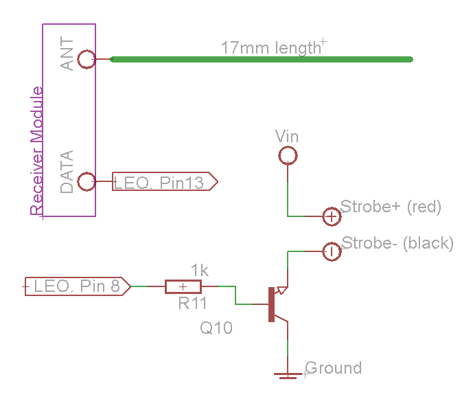
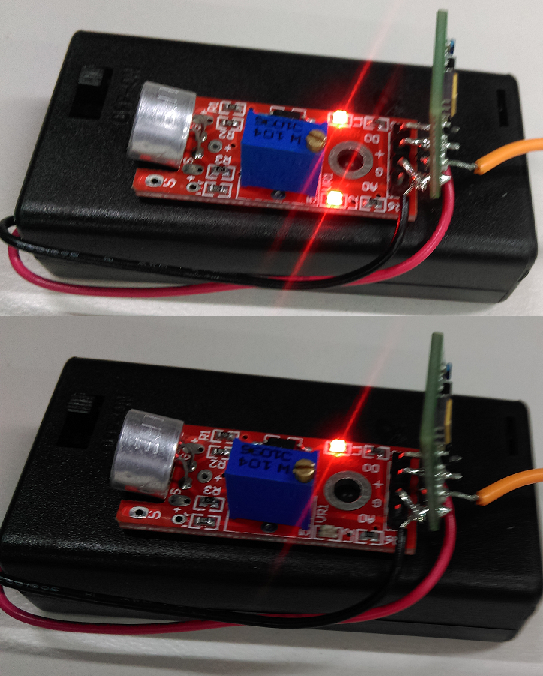
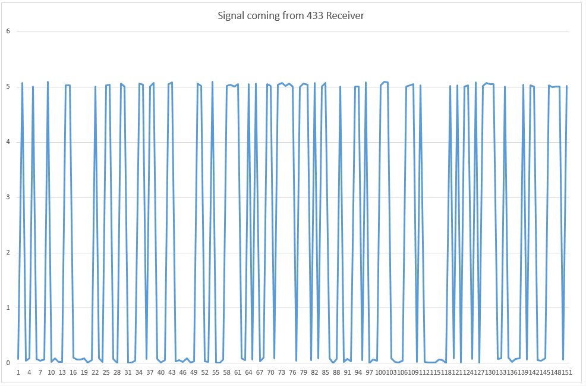
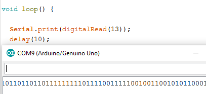
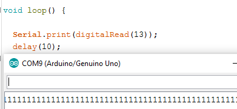

# Wireless Silent Notifier
_Sight and Sound_

This is a perfect project for new mums and dads or anyone that
needs to be alerted without making a sound. Included is a simple base station that picks up wireless signals, a sensor (in this case a sound level sensor) and a strobe light. As soon as the baby cries the strobe light will go off alerting you. Whilst 1 detector is included in this project you can use any number of different types, depending on what you want to measure and be alerted for (temperature, moisture, door entry, ph levels etc.).

## Bill of Materials

#### Base Station
| Qty | Code | Description
| :------------- | :------------- | --- |
|1 | [MP3058](http://jaycar.com.au/p/MP3058) | 12V power supply |
|1 | [XC4430](http://jaycar.com.au/p/XC4430) | Leonardo main board |
|1 | [ZW3102](http://jaycar.com.au/p/ZW3102) | 433Mhz receiver |
|1 | [LA5328](http://jaycar.com.au/p/LA5328) | LED Strobe Light |
|1 | [ZT2116](http://jaycar.com.au/p/ZT2116) | BC338 NPN Transistor |
| | | A small resistor and some wire to act as antenna |

#### Transmitter
_Use any style of transmitter you want, this is just an example_

| Qty | Code | Description
| :------------- | :------------- | --- |
|1 | [ZW3100](http://jaycar.com.au/p/ZW3100) | 433Mhz Transmitter |
|1 | [PH9280](http://jaycar.com.au/p/PH9280) | 2AA switched battery compartment |
|1 | [XC4438](http://jaycar.com.au/p/XC4438) | Sound sensor module |
| | | Some spare wire to act as antenna |

## Connection schematics

#### Base Station

The 12V strobe light is a very simple circuit, we are simply using the `Vin` pin to syphon the 12V from the DC jack into the strobe light, using the NPN transistor as a "low side switch"

We connect Pin 8 to drive the circuit; when pin 8 is high, current is applied to the base of the transistor and switches on, allowing the strobe to connect to ground and complete the circuit.

We've used a 1k resistor but you've got playing room for different values depending on how much current you want to drive through the transistor.

Use the falstad app to play around with different set-ups and see if your resistors work and how much current they provide. [Here's a link to the falstad  applet ](https://www.falstad.com/circuit/circuitjs.html?cct=$+1+0.000005+10.20027730826997+50+5+43%0At+352+192+288+192+1+1+0.6336865455998801+0.352593191562486+100%0Ag+288+208+288+240+0%0Ar+352+192+416+192+0+1000%0AR+448+176+496+176+0+0+40+5+0+0+0.5%0AR+288+80+288+64+0+0+40+12+0+0+0.5%0AS+416+192+448+192+0+0+false+0+2%0Ag+448+208+448+224+0%0A162+288+80+288+176+1+12+1+0+0+0.01%0A)

The receiver module is easy enough to install, one side has `VCC`, 2x`GND`, and `ANT` (for antenna) and the other side has `VCC`,`GND`, and 2x `DATA`

Connect `VCC` and `GND` to where they've got to go (on both sides), then `DATA` to `pin13` on the Arduino, and connect a 17mm wire to `ANT`

| Arduino | Receiver ZW3102  | Transistor | Description |
| ---  | --- | --- | --- |
| 5V | VCC | | Power supply |
| GND | GND | Collector | Ground connections |
| 13 | DATA | | Data from wireless receiver to the Arduino |
| 8 | | Base ( with resistor)| through the resistor to the base of the transistor |
| | ANT | | 17mm wire to act as antenna |
| Vin | | | Positive lead of LED Strobe light |

The Emitter of the Transistor should be connected to the negative (black) lead of the strobe light.

* you should be able to test the code now and find that you get random data on `pin13` and turning `pin8` on/off will turn on/off the strobe light.

#### Transmitter

The transmitter is a simple set up, as `ZW3100` only has 4 connections ( with an extra ground):

|Pin| Description|
| --- | --- |
| ANT | Antenna |
| GND | Ground |
| VCC | Power |
| DATA | Data input |
| GND | Ground |

`DATA` is the only pin that we're concerned about here, after you've connected the power rails and 17mm antenna. Whenever DATA is activated, the transmitter will send a signal burst to be picked up by the receiver.

For our purposes, we're going to be using the [XC4438](http://jaycar.com.au/p/XC4438) sound module, that has a digital output when the sound level goes beyond the threshold value, which is set with the potentiometer.

_Sound Module providing a digital output (indicated with the second LED in the top picture) - when the LED is on, it is transmitting a digital signal (not audio) to be picked up by our base station._

Connections are simple:

| Sound Module | Transmitter | Battery Pack |
| --- | --- | --- |
| G | GND | Black lead |
|+ | VCC | Red Lead |
| D0 | DATA | |

with the antenna on `ANT`. You can probably do much better design than what we have in the image above.

## Programming

This is a very simple project and only requires a few lines of code. Dig into the code and have a read of the comments to make sure you understand what is going on.

One of the main points about the code is figuring out what signal is from our sensor. In our unit, we are simply checking for over 200 points of the same data signal, which signifies that there's something transmitting that continuous stream of either 0's or 1's.

While the transmitter is off, our receiver picks up something similar to this:

You could even try and see it in the Serial monitor, and it'd give the same garbled information:

However once our transmitter is on, we get something like this:

Our code simply counts the number of repeated signals, and checks that it's more than 400 samples of the same signal (_40milliseconds worth_), before turning on the strobe light for 4 seconds.

## Use

Simply connect 12v power to the Arduino, and turn the transmitter on. Adjust the potentiometer on the transmitter so that the second LED only lights up when it can detect sound (speak into it a few times to get the value just right)  - then place where you need it to be.

Back at the base station, you'll be notified any time the sensor picks up some audio.

## Future Improvements
Our default code just checks for a long chain of FSK data, if you want to, you can use another Arduino to encode information, such as "ID" or certain values, and then decode it on the base station.
